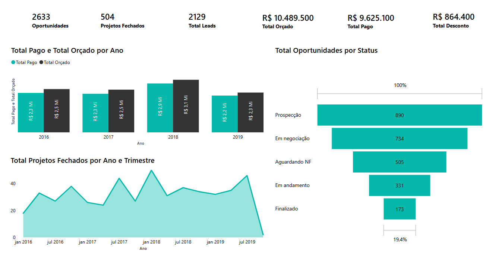
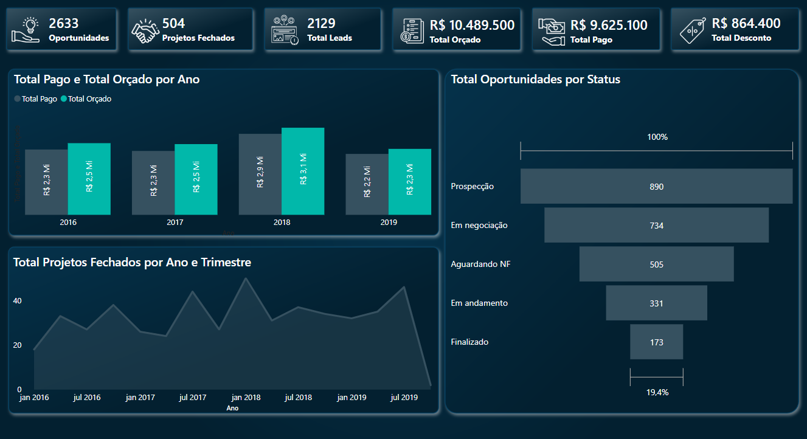

# 📊 Evolução do Dashboard de Oportunidades

## 🆚 Antes x Depois

| Elemento                     | Antes                                                                 | Depois                                                                |
|-----------------------------|------------------------------------------------------------------------|------------------------------------------------------------------------|
| **Design Visual**           | Estilo claro e genérico                                               | Interface escura, moderna e profissional                              |
| **Ícones nos KPIs**         | Ausente                                                               | Ícones visuais que facilitam a identificação rápida                   |
| **Organização dos Dados**   | Linear e simplificada                                                 | Blocos visuais bem destacados                                         |
| **Cores de Gráficos**       | Paleta com baixo contraste                                            | Cores otimizadas para leitura em modo escuro                          |
| **Bordas e Cartões**        | Sem bordas claras                                                     | Cartões com contornos suaves e efeito de profundidade                 |
| **Legibilidade dos Gráficos**| Razoável                                                              | Alta, com fontes mais visíveis e contraste adequado                   |
| **Estética Geral**          | Funcional, mas simples                                                | Profissional, envolvente e alinhada com padrões modernos de design    |

---

## 📈 Aprendizados com a Evolução

- ✅ **Design importa!**  
  A estética visual impacta diretamente na percepção de valor. Um dashboard bem construído prende a atenção e facilita insights.

- 🧭 **UX e Data Storytelling**  
  Ícones, espaçamentos, agrupamentos visuais e contrastes tornam a navegação mais fluida e ajudam a contar uma história com os dados.

- 🛠️ **Consistência visual gera credibilidade**  
  Dashboards padronizados transmitem profissionalismo e confiança aos stakeholders e tomadores de decisão.
- 🔍 **Pequenos detalhes, grande impacto**  
  Ícones bem posicionados, bordas suaves e organização clara fazem toda a diferença na experiência do usuário.

---

## 💡 Reflexão Empreendedora

> _"No mundo das startups e da análise de dados, a forma como você apresenta o valor é tão importante quanto o valor em si."_  
> _Um visual impactante transforma um insight técnico em uma narrativa de negócios convincente._

---

## 📸 Screenshots

### 🔽 Antes

### 🔼 Depois

---

## 🚀 Ferramentas Utilizadas

- Power BI
- Design de UI/UX focado em visualização de dados
- Princípios de storytelling visual

---

## ✍️ Autor

**Juan Mendes**  
Estudante de Empreendedorismo e entusiasta de Business Intelligence.  
[LinkedIn](https://www.linkedin.com/in/juan-mendes-739084273)
